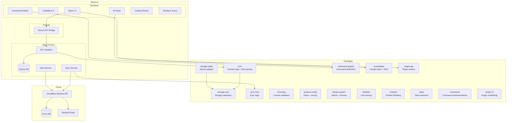
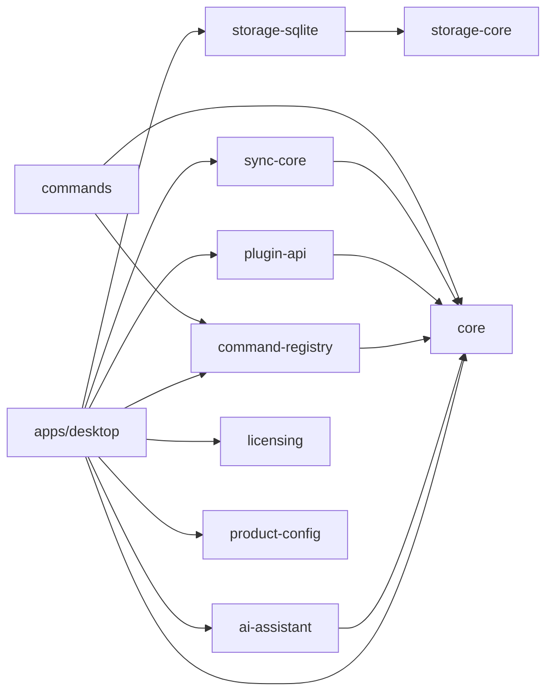
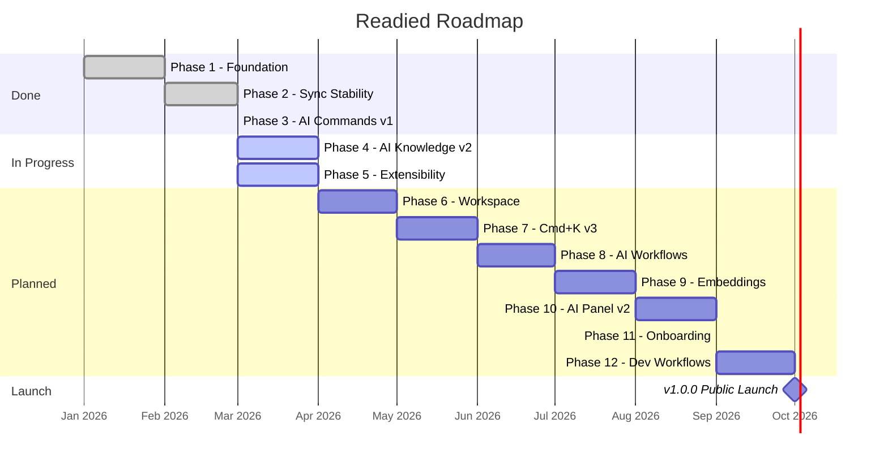

# Readied --- Product Roadmap

> **Last updated:** 2026-03-13
> **Current version:** v0.9.0
> **Status:** Phases 1--5 complete, Phase 6+ in planning

---

## Vision

Readied is a **Markdown-first thinking workspace for builders**. Raycast meets Obsidian meets lightweight IDE for ideas.

Your notes survive the app. Your thinking stays yours. AI augments, never replaces.

---

## Core Principles

| #   | Principle                | What it means                                                                    |
| --- | ------------------------ | -------------------------------------------------------------------------------- |
| 1   | **Markdown-first**       | Users own their data. Plain `.md` files, git-friendly, export = exact copy.      |
| 2   | **Local-first**          | Fast, offline, no cloud dependency. Sync is optional, never required.            |
| 3   | **Command-driven UX**    | Raycast-like Cmd+K, keyboard-first. Every action is a command.                   |
| 4   | **AI as augmentation**   | AI operates ON notes --- summarize, expand, extract. It never replaces thinking. |
| 5   | **Speed and minimalism** | Developer-grade ergonomics. Start fast, stay fast, no bloat.                     |

---

## What's Done (v0.9.0)

### Phase 1: Foundation

- Website redesign with CodeRabbit review fixes
- Auth UX rethink: "Enable Sync" modal, deep link race condition fix
- Auth middleware hardening (all JWT error types return 401 with JSON)
- Full API documentation (24 endpoints)

### Phase 2: Sync Stability

- Auto-sync error propagation to renderer via IPC events
- Exponential backoff on repeated failures (capped at 5 minutes)
- 401 auto-stops sync and emits `auth-expired` event
- Abort in-flight sync on logout via AbortController
- Token refresh with typed errors (expired / network / device_limit)
- Sync onboarding flow (prompt after 5 notes, session-dismissable)
- Offline queue visibility in status bar (pending count + offline indicator)

### Phase 3: AI Commands (Cmd+K v1)

- Cmd+K opens AI panel; insert-link remapped to Cmd+Shift+K
- AI command definitions: `ai:toggle-panel`, `ai:summarize`, `ai:rewrite`, `ai:tweet`, `ai:ask-notes`
- AI Settings: API key, model selector, max context notes
- Settings schema v2 with migration from v1
- Escape cascade: palette -> AI panel -> graph -> search
- Existing `ai-assistant` package (Claude client, RAG, prompts) wired into panel

### Phase 4: AI Knowledge (Cmd+K v2) --- Pending

- RAG integration: query across notes
- "Ask Your Notes" command with knowledge context
- Related notes context in AI prompts

### Phase 5: Extensibility --- Pending

- Plugin API for custom AI commands (`registerAiCommand` on PluginContext)
- AI command presets (shareable JSON bundles with validation)
- Import/export AI command definitions
- Community command marketplace concept

### Infrastructure

| Component        | Technology                       |
| ---------------- | -------------------------------- |
| Runtime          | Electron + electron-vite         |
| Frontend         | React + TanStack Query + Zustand |
| Editor           | CodeMirror 6                     |
| Database         | SQLite (better-sqlite3)          |
| Monorepo         | pnpm + turborepo                 |
| Backend API      | Cloudflare Workers               |
| Auth             | Magic link (Resend) + JWT        |
| Database (cloud) | Turso (libsql)                   |

---

## Phase 6: Markdown Workspace Enhancement

> **Goal:** Make Readied feel like a real workspace, not a single-note editor.

| Feature                  | Description                                                | Priority |
| ------------------------ | ---------------------------------------------------------- | -------- |
| File tree                | Sidebar with workspace folders, drag-and-drop organization | High     |
| Quick Open               | Fuzzy file finder (Cmd+P) across all notes                 | High     |
| Backlinks graph v2       | Improved graph visualization, filtering, zoom-to-node      | Medium   |
| Tags system v2           | Tag hierarchy, tag autocomplete, tag-based navigation      | Medium   |
| Git-friendly structure   | Option to store notes as `.md` files on disk (vault mode)  | Medium   |
| Obsidian-like navigation | Forward/back history, breadcrumbs, link preview on hover   | Low      |

**Key decisions:**

- Vault mode (files on disk) is opt-in; SQLite remains the default for performance
- Quick Open reuses the command palette infrastructure (same fuzzy matching engine)
- Tags are derived from markdown frontmatter and inline `#tag` syntax

---

## Phase 7: Command Palette Evolution (Cmd+K v3)

> **Goal:** Make the command palette the Raycast of note-taking --- fast, extensible, context-aware.

| Feature                    | Description                                                       | Priority |
| -------------------------- | ----------------------------------------------------------------- | -------- |
| Raycast-style architecture | Typed results, inline previews, action chains                     | High     |
| Plugin-style commands      | Community commands via plugin API                                 | High     |
| Command discovery UX       | Categories, recent commands, favorites, frequency sorting         | Medium   |
| Contextual commands        | Different commands based on selection, note type, cursor position | Medium   |
| Template insertion         | Insert note templates, code snippets, date patterns via commands  | Medium   |
| Quick actions              | Create note, open note, search, insert template --- all sub-50ms  | Low      |

**Command categories:**

```
Navigation    ai           editor        notes
  open-note     summarize    bold          create
  open-folder   rewrite      heading       delete
  switch-tab    tweet        link          pin
  search        ask-notes    code-block    move
```

**Extensibility model:**

- Commands are registered via `PluginContext.registerCommand()`
- AI commands use `PluginContext.registerAiCommand()` with template placeholders
- Presets are shareable JSON bundles (`AiCommandPreset` type with validation)

---

## Phase 8: AI Workflows on Notes

> **Goal:** Turn notes into action with a pipeline model: Note -> Action -> Result.

| Feature                 | Description                                                         | Priority |
| ----------------------- | ------------------------------------------------------------------- | -------- |
| Action pipeline         | Note -> Action -> Result with configurable output targets           | High     |
| Built-in actions        | Summarize, expand, tweet thread, blog draft, explain, extract tasks | High     |
| Output targets          | Insert in note, clipboard, side panel, new note                     | High     |
| Streaming responses     | Token-by-token rendering in AI panel                                | Medium   |
| Action chaining         | Summarize -> Tweet -> Copy (multi-step workflows)                   | Medium   |
| Custom workflow builder | Visual workflow editor for composing action chains                  | Low      |

**Output target model:**

```
outputTarget: 'replace'   -- Replace selected text in editor
             | 'insert'   -- Insert at cursor position
             | 'panel'    -- Show in AI panel (chat)
             | 'clipboard' -- Copy to clipboard
             | 'new-note'  -- Create a new note with result
```

**Built-in action presets:**

| Action        | Input     | Output    | Use case                             |
| ------------- | --------- | --------- | ------------------------------------ |
| Summarize     | Full note | Panel     | Quick overview of long notes         |
| Expand        | Selection | Replace   | Flesh out bullet points              |
| Tweet thread  | Full note | Clipboard | Content repurposing                  |
| Blog draft    | Selection | New note  | Turn rough ideas into posts          |
| Extract tasks | Full note | Insert    | Pull action items from meeting notes |
| Explain       | Selection | Panel     | Clarify technical content            |

---

## Phase 9: Knowledge Retrieval (Embeddings)

> **Goal:** "What did I write about X?" --- semantic search across all notes.

| Feature              | Description                                          | Priority |
| -------------------- | ---------------------------------------------------- | -------- |
| Markdown chunking    | Heading-based and block-based splitting              | High     |
| Embedding generation | Local (transformers.js) or API-based                 | High     |
| Vector storage       | SQLite with vec extension or dedicated store         | High     |
| Semantic search      | Query all notes by meaning, not just keywords        | High     |
| Prompt composition   | Inject retrieved context into AI prompts             | Medium   |
| Index management     | On-save indexing, background reindex, manual rebuild | Medium   |

**Chunking strategy:**

```
Document: "# Architecture\n\nWe use React...\n\n## State\n\nZustand for UI..."

Chunks:
  [1] heading="Architecture"  content="We use React..."
  [2] heading="State"         content="Zustand for UI..."
```

**Embedding options under evaluation:**

| Option                  | Pros                          | Cons                              |
| ----------------------- | ----------------------------- | --------------------------------- |
| transformers.js (local) | Offline, private, no API cost | Model size (~50MB), slower on CPU |
| OpenAI API              | High quality, fast            | Requires internet, API cost       |
| Local ONNX model        | Good balance, offline         | Setup complexity                  |

**Indexing lifecycle:**

```
Note saved -> chunk -> embed -> store vectors
Query -> embed query -> cosine similarity -> top-k chunks -> compose prompt
```

---

## Phase 10: AI Assistant Panel v2

> **Goal:** A conversational AI that knows your notes and remembers your questions.

| Feature                  | Description                                                   | Priority |
| ------------------------ | ------------------------------------------------------------- | -------- |
| Conversation memory      | Persist chat history across sessions                          | High     |
| Context injection        | Current note, selected text, search results as context        | High     |
| Multi-turn conversations | Follow-up questions with note awareness                       | Medium   |
| Side panel UX v2         | Resizable panel, markdown rendering, code highlighting        | Medium   |
| Quick actions from chat  | Insert response into note, create new note, copy to clipboard | Medium   |
| Conversation management  | Name, search, delete past conversations                       | Low      |

**Context injection model:**

```
System prompt
  + Conversation history (last N turns)
  + Current note content (if open)
  + Selected text (if any)
  + RAG results (if knowledge query)
  = Final prompt to LLM
```

---

## Phase 11: Onboarding Experience

> **Goal:** Value within 2 minutes.

| Step | What happens                                                  | Time |
| ---- | ------------------------------------------------------------- | ---- |
| 1    | Welcome screen: "Your thinking workspace"                     | 10s  |
| 2    | Create first note (pre-filled template with instructions)     | 30s  |
| 3    | Command palette tutorial (Cmd+K highlight)                    | 20s  |
| 4    | First AI action: summarize or generate tweet from sample note | 30s  |
| 5    | Knowledge search demo: "Ask your notes" with seeded content   | 20s  |
| 6    | Done: workspace ready, user understands core loop             | 10s  |

**Principles:**

- No account required to start
- No configuration required to start
- AI features work with a single API key entry
- Every step is skippable
- Progress persists if interrupted

---

## Phase 12: Developer Workflows

> **Goal:** Make Readied the best place to think about code, not write code.

| Feature                       | Description                                              | Priority |
| ----------------------------- | -------------------------------------------------------- | -------- |
| Code snippet management       | Syntax-highlighted snippets with language detection      | Medium   |
| Technical doc templates       | RFC, ADR, API doc, runbook templates                     | Medium   |
| API documentation generator   | AI-powered: paste endpoint -> generate docs              | Low      |
| Meeting notes -> action items | AI extraction of tasks, decisions, owners                | Medium   |
| Decision log templates        | Lightweight ADR format with status tracking              | Low      |
| Architecture Decision Records | Structured template with context, decision, consequences | Low      |

**Template examples:**

```markdown
# ADR-001: [Decision Title]

- **Status:** Proposed | Accepted | Deprecated
- **Date:** {{date}}
- **Context:** Why is this decision needed?
- **Decision:** What was decided?
- **Consequences:** What are the trade-offs?
```

---

## Technical Architecture



### Package Dependency Graph



### AI Pipeline

```mermaid
flowchart LR
    Input[User Input<br/>selection / note / query] --> Template[Template Resolution<br/>{{selection}} {{note}} {{title}}]
    Template --> Context[Context Assembly<br/>system prompt + user prompt + RAG]
    Context --> LLM[LLM API<br/>Claude / OpenAI]
    LLM --> Output[Output Routing<br/>replace / insert / panel / clipboard]
```

---

## Release Strategy

### Versioning

Readied follows [Semantic Versioning](https://semver.org/):

| Version bump      | When                              | Example                    |
| ----------------- | --------------------------------- | -------------------------- |
| **Major** (X.0.0) | Breaking changes, major UX shifts | v1.0.0: public launch      |
| **Minor** (0.X.0) | New features, non-breaking        | v0.10.0: workspace folders |
| **Patch** (0.0.X) | Bug fixes, polish                 | v0.9.1: fix sync edge case |

### Branch Strategy (Git Flow)

```
main            <-- Production releases only
  \-- develop   <-- Integration branch
        \-- feature/*   <-- New features
        \-- fix/*       <-- Bug fixes
        \-- release/*   <-- Release preparation
```

### Release Cadence

| Channel     | Frequency  | Audience                |
| ----------- | ---------- | ----------------------- |
| **Stable**  | Monthly    | All users               |
| **Beta**    | Bi-weekly  | Early adopters (opt-in) |
| **Nightly** | Daily (CI) | Contributors only       |

### Release Checklist

- [ ] All tests pass (`pnpm test`)
- [ ] Build succeeds (`pnpm build`)
- [ ] TypeScript clean (`pnpm typecheck`)
- [ ] Changelog updated
- [ ] Version bumped in `package.json`
- [ ] Release branch merged to `main` and back to `develop`
- [ ] macOS build signed and notarized
- [ ] Release notes published on GitHub

---

## Milestone Timeline



---

## Contributing

Readied is built in the open. If you want to contribute:

1. Check the [issues](https://github.com/tomymaritano/readide/issues) for `good first issue` labels
2. Read `CLAUDE.md` for project conventions
3. Read `plan.md` for architecture decisions
4. Branch from `develop`, target PRs to `develop`
5. Follow conventional commits (`feat:`, `fix:`, `refactor:`, etc.)

---

_This roadmap is a living document. Priorities shift based on user feedback and technical discovery. Last major update: 2026-03-13._
