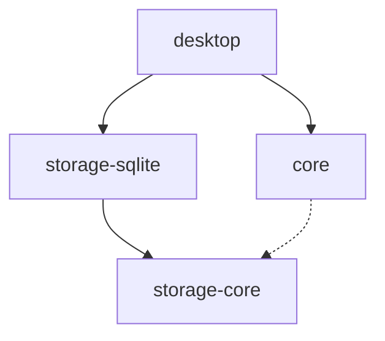

# Architecture Overview

Readied follows a clean architecture with strict separation of concerns.

## Monorepo Structure

```
readied/
├── apps/
│   ├── desktop/           # Electron app
│   │   ├── src/main/      # Main process (SQLite, IPC)
│   │   ├── src/preload/   # Secure bridge
│   │   └── src/renderer/  # React UI
│   ├── docs-site/         # This documentation (VitePress)
│   └── site/              # Marketing site (Astro)
├── packages/
│   ├── core/              # Domain logic + markdown parsing
│   ├── storage-core/      # Storage interfaces + utilities
│   └── storage-sqlite/    # SQLite implementation
└── docs/                  # Static documentation assets
```

## Package Dependencies



## Data Flow

```
┌─────────────────────────────────────────────────────────────┐
│                     Renderer Process                         │
│  ┌─────────────┐    ┌─────────────┐    ┌─────────────┐     │
│  │   React UI  │ -> │  TanStack   │ -> │   Preload   │     │
│  │             │    │   Query     │    │   Bridge    │     │
│  └─────────────┘    └─────────────┘    └──────┬──────┘     │
└────────────────────────────────────────────────┼────────────┘
                                                 │ IPC
┌────────────────────────────────────────────────┼────────────┐
│                      Main Process              │            │
│  ┌─────────────┐    ┌─────────────┐    ┌──────┴──────┐     │
│  │   SQLite    │ <- │    Core     │ <- │     IPC     │     │
│  │   (better   │    │  Operations │    │   Handlers  │     │
│  │   -sqlite3) │    │             │    │             │     │
│  └─────────────┘    └─────────────┘    └─────────────┘     │
└─────────────────────────────────────────────────────────────┘
```

## Key Boundaries

### 1. Core Package (`@readied/core`)

- Pure domain logic
- No Electron or React dependencies
- Testable in Node.js
- Defines Note entity, operations, and contracts

### 2. Storage Core (`@readied/storage-core`)

- Database adapter interfaces
- Migration runner
- Backup/Export/Import utilities
- No native dependencies

### 3. Storage SQLite (`@readied/storage-sqlite`)

- SQLite implementation (better-sqlite3)
- Repository implementations
- Migration definitions
- **Only package with native deps**

### 4. Desktop App (`@readied/desktop`)

- Electron + electron-vite
- Main process: SQLite, IPC handlers
- Renderer: React + CodeMirror 6
- Preload: Typed API bridge

## Security Model

| Rule               | Description                 |
| ------------------ | --------------------------- |
| No nodeIntegration | Renderer is sandboxed       |
| IPC whitelist      | Typed channels only         |
| No executeSQL      | No raw SQL in renderer      |
| Preload minimal    | Only necessary APIs exposed |

## Technology Stack

| Layer    | Technology               |
| -------- | ------------------------ |
| Runtime  | Electron                 |
| Build    | electron-vite            |
| Database | SQLite (better-sqlite3)  |
| Editor   | CodeMirror 6             |
| UI State | TanStack Query + Zustand |
| Styling  | Tailwind CSS             |
| Monorepo | pnpm + turborepo         |
