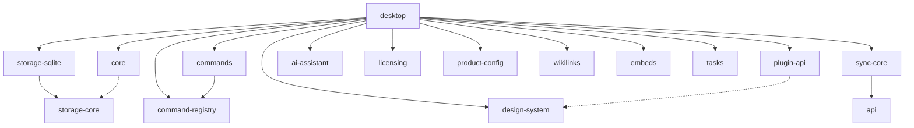

# Architecture Overview

Readied follows a clean architecture with strict separation of concerns.

## Monorepo Structure

```
readied/
├── apps/
│   ├── desktop/           # Electron app
│   │   ├── src/main/      # Main process (SQLite, IPC, sync)
│   │   ├── src/preload/   # Secure bridge
│   │   └── src/renderer/  # React UI
│   ├── docs-site/         # Documentation (VitePress)
│   └── web/               # Marketing + docs (Next.js + Fumadocs)
├── packages/
│   ├── ai-assistant/      # AI assistant integration
│   ├── api/               # Supabase API backend
│   ├── command-registry/  # Command palette system
│   ├── commands/          # Built-in commands
│   ├── core/              # Domain logic + markdown parsing
│   ├── design-system/     # Design tokens (CSS custom properties)
│   ├── embeds/            # URL embed resolution
│   ├── licensing/         # License validation
│   ├── plugin-api/        # Plugin system API
│   ├── plugin-cli/        # Plugin CLI scaffolding tool
│   ├── product-config/    # Product configuration
│   ├── storage-core/      # Storage interfaces + utilities
│   ├── storage-sqlite/    # SQLite implementation
│   ├── sync-core/         # Sync engine (Supabase)
│   ├── tasks/             # Task management / extraction
│   └── wikilinks/         # [[wikilink]] parsing + resolution
└── docs/                  # Static documentation assets
```

16 packages organized by domain responsibility.

## Package Dependencies



## Data Flow

```
┌──────────────────────────────────────────────────────────────────┐
│                      Renderer Process                            │
│  ┌──────────┐  ┌──────────┐  ┌──────────┐  ┌──────────────┐    │
│  │ React UI │->│ TanStack │->│  Zustand  │->│   Preload    │    │
│  │          │  │  Query   │  │  Stores   │  │   Bridge     │    │
│  └──────────┘  └──────────┘  └──────────┘  └──────┬───────┘    │
└───────────────────────────────────────────────────┼─────────────┘
                                                    │ IPC
┌───────────────────────────────────────────────────┼─────────────┐
│                      Main Process                 │             │
│  ┌──────────┐  ┌──────────┐  ┌──────────┐  ┌─────┴───────┐    │
│  │  SQLite  │<-│   Core   │<-│  Plugin  │<-│    IPC      │    │
│  │ (better  │  │Operations│  │  System  │  │  Handlers   │    │
│  │ -sqlite3)│  │          │  │          │  │             │    │
│  └──────────┘  └──────────┘  └──────────┘  └─────────────┘    │
│                                    │                            │
│                              ┌─────┴───────┐                    │
│                              │  Sync Core  │                    │
│                              │  (Supabase) │                    │
│                              └─────────────┘                    │
└─────────────────────────────────────────────────────────────────┘
```

## Key Boundaries

### 1. Core Package (`@readied/core`)

- Pure domain logic
- No Electron or React dependencies
- Testable in Node.js
- Defines Note entity, operations, and contracts

### 2. Storage Core (`@readied/storage-core`)

- Database adapter interfaces
- Migration runner
- Backup/Export/Import utilities
- No native dependencies

### 3. Storage SQLite (`@readied/storage-sqlite`)

- SQLite implementation (better-sqlite3)
- Repository implementations
- Migration definitions
- **Only package with native deps**

### 4. Plugin API (`@readied/plugin-api`)

- Plugin lifecycle and registration
- Extension points (editor, themes, commands)
- Sandboxed plugin context
- Theme registry for CSS variable overrides

### 5. Sync Core (`@readied/sync-core`)

- Supabase-based sync engine
- Push/pull operations
- Conflict resolution
- Sync state management

### 6. Command System (`@readied/command-registry` + `@readied/commands`)

- Command palette infrastructure
- Built-in command definitions
- Keybinding management

### 7. Companion Packages

- **`@readied/wikilinks`** - `[[wikilink]]` parsing and resolution
- **`@readied/tasks`** - Task extraction from markdown
- **`@readied/embeds`** - URL embed resolution
- **`@readied/ai-assistant`** - AI assistant integration
- **`@readied/design-system`** - Design tokens as CSS custom properties
- **`@readied/licensing`** - License validation
- **`@readied/product-config`** - Pricing, plans, and product metadata

### 8. Desktop App (`@readied/desktop`)

- Electron + electron-vite
- Main process: SQLite, IPC handlers, sync, plugins
- Renderer: React + CodeMirror 6
- Preload: Typed API bridge

## Security Model

| Rule               | Description                     |
| ------------------ | ------------------------------- |
| No nodeIntegration | Renderer is sandboxed           |
| IPC whitelist      | Typed channels only             |
| No executeSQL      | No raw SQL in renderer          |
| Preload minimal    | Only necessary APIs exposed     |
| Plugin sandbox     | Plugins run in isolated context |

## Technology Stack

| Layer    | Technology                          |
| -------- | ----------------------------------- |
| Runtime  | Electron                            |
| Build    | electron-vite                       |
| Database | SQLite (better-sqlite3)             |
| Editor   | CodeMirror 6                        |
| UI State | TanStack Query + Zustand            |
| Styling  | CSS Modules + CSS custom properties |
| Sync     | Supabase (via sync-core)            |
| Monorepo | pnpm + turborepo                    |
