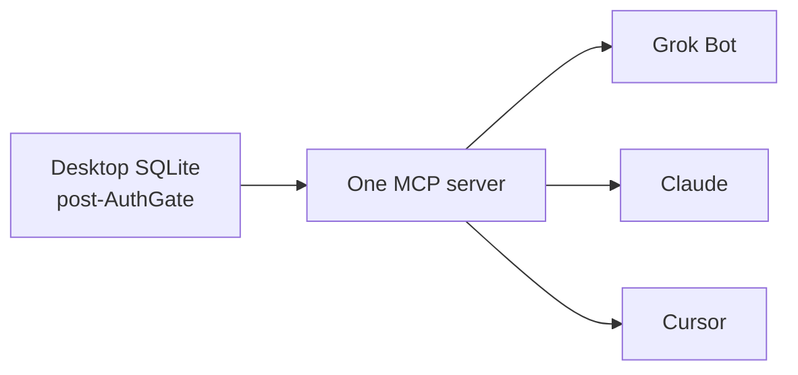

# Technical decisions

Accepted product calls live as ADRs. Dated log: [updates](./updates.md). Mobile plan: [`docs/mobile/PLAN.md`](../mobile/PLAN.md).

| ADR                                      | Decision                               |
| ---------------------------------------- | -------------------------------------- |
| [002](../adr/002-authgate-stays.md)      | AuthGate is the first window           |
| [003](../adr/003-sqlite-not-couchdb.md)  | Local store is SQLite                  |
| [004](../adr/004-mcp-over-local-http.md) | MCP prefers Local HTTP                 |
| [005](../adr/005-mobile-own-repo.md)     | Mobile is dripnex/ios, not dripnex/app |

## How agents talk to notes

Not a product-scope dump.

| File                         | What it is                             |
| ---------------------------- | -------------------------------------- |
| [mcp-plan.md](./mcp-plan.md) | Target shape: one MCP, every AI client |
| [updates.md](./updates.md)   | Dated decisions (22 Aug 2026 on)       |

Living board: [`docs/NOW.md`](../NOW.md). Plugins: [`docs/PLUGIN_SYSTEM.md`](../PLUGIN_SYSTEM.md). Current stdio server: [`packages/mcp-server`](../../packages/mcp-server/README.md).
