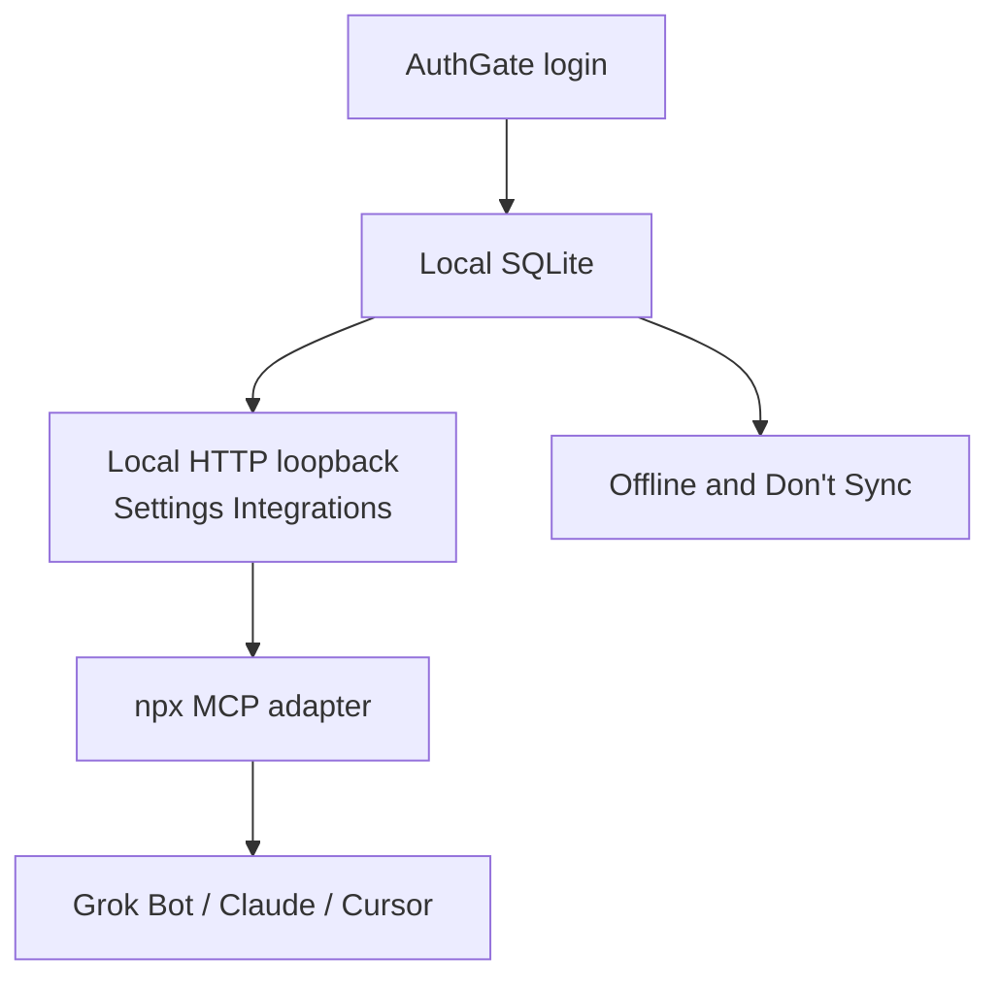
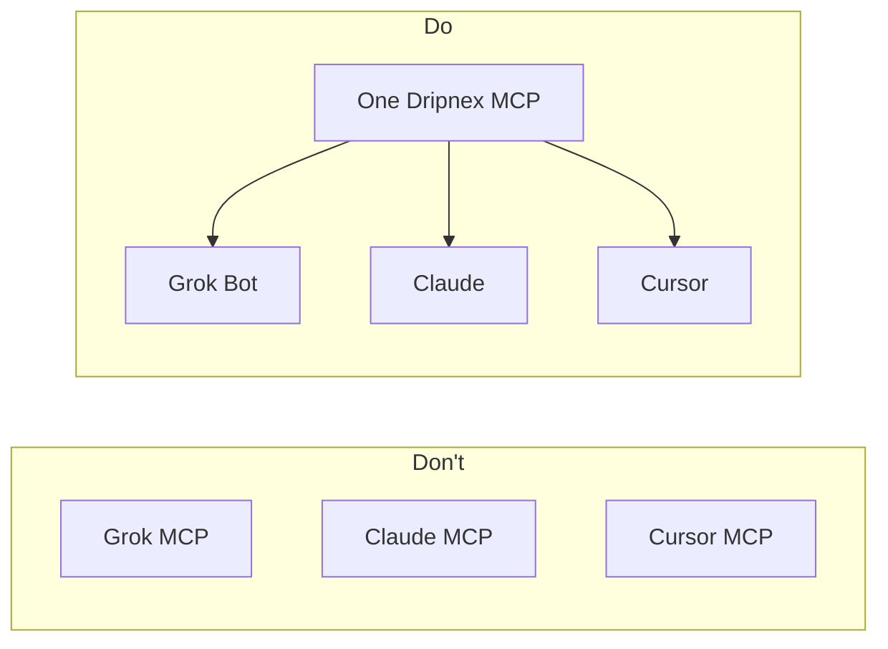
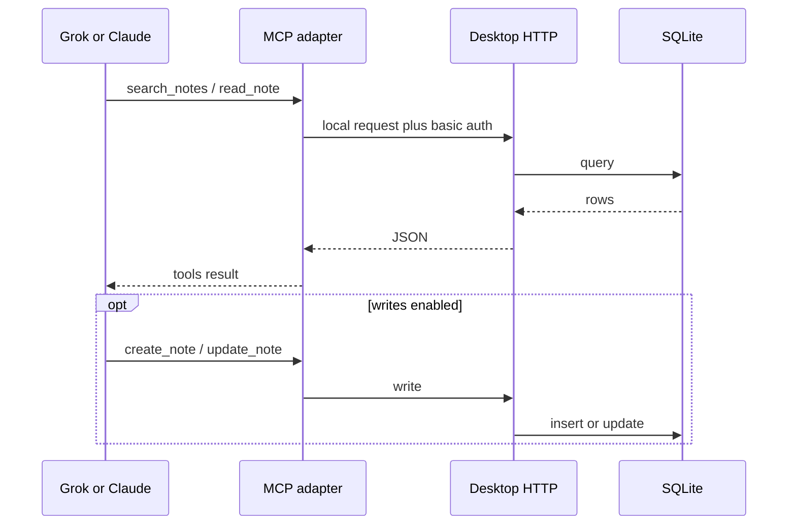
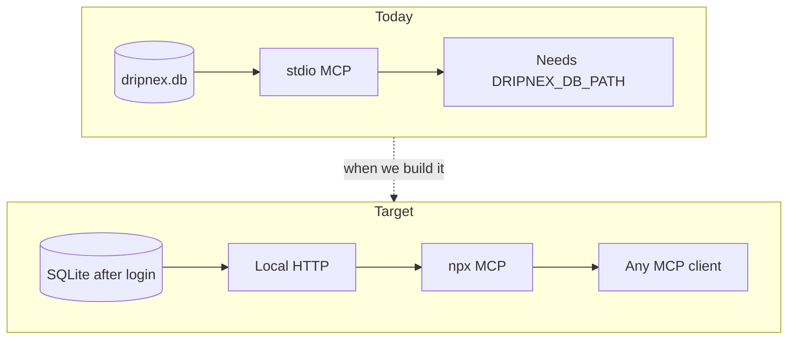

# MCP plan: one server, every AI

Status: **plan only**. Do not implement until Tomas asks. Later, not v1.

Copy [Inkdrop](https://docs.inkdrop.app/reference/mcp-server): the desktop (after AuthGate) is the source of truth. A thin MCP talks to that. Grok Bot, Claude, Cursor, and anything else MCP-capable use the **same** server. Do not ship a different integration per model.

## Shape

AuthGate is first. Offline and Don't Sync are after login, not instead of it. Official Inkdrop: [start guide](https://docs.inkdrop.app/start-guide) ("You'll see a login screen"); [privacy 5.4](https://docs.inkdrop.app/privacy) (account required for client apps); [local HTTP](https://developers.inkdrop.app/guides/integrate-with-external-programs).

## Why not one connector per AI

Grok Bot, Claude Desktop, Claude Code, and Cursor all speak MCP. A Cursor marketplace plugin is only a wrapper (connector + a skill). The product is the server.

## Two layers (Inkdrop shape)

1. **Inside the app (after login).** Local HTTP on loopback (Inkdrop default `127.0.0.1:19840`), basic auth. Starts from Settings > Integrations. Notes stay in SQLite.
2. **Outside the app.** A small package (`npx @dripnex/mcp-server` or today's `packages/mcp-server`) that translates MCP tools to that HTTP API. Tools: search / read / list notes, notebooks, tags; create / update when writes are on.

Grok Bot connects as a **local** connector (`command` + `env`), not a hosted SaaS MCP. Claude and Cursor get the same `npx` line.

## What exists today vs target

`packages/mcp-server` is a **stdio** server that opens the desktop SQLite file directly (WAL). Read tools are the product. Writes stay off unless Settings > Integrations > Allow writes (`mcp.json`) or `DRIPNEX_MCP_WRITES=1`.

That works on a machine that already has `DRIPNEX_DB_PATH`. It is not the Inkdrop shape: no local HTTP, no generated credentials.

Plugin AppAPI is still **read-only** ([PLUGIN_SYSTEM](../PLUGIN_SYSTEM.md) Phase 3). MCP writes are a separate, opt-in path. Do not give every plugin note CRUD to "be like MCP".

## Target (when we build it)

1. Local HTTP in desktop after AuthGate (loopback + user/pass). Same job as Inkdrop Integrations.
2. Point `packages/mcp-server` at that HTTP URL (Inkdrop env: server URL, username, password). Keep SQLite-direct as a fallback, or drop it once HTTP is real.
3. One published `npx` entry so clients do not need a monorepo path.
4. Optional Cursor plugin: connector + one skill (how Dripnex notes are written). Skills are know-how; MCP is hands. See [Inkdrop agent skills](https://docs.inkdrop.app/reference/agent-skills).

## Do not build now

- Inline AI / next-edit as the integration story. Inkdrop does that with a **user-supplied** API key ([AI integrations](https://docs.inkdrop.app/reference/ai-integrations)). Different product.
- A hosted MCP that reads notes in the cloud. Notes are local-first.
- Marketplace, clipper, graph-as-AI, mobile. See [#551](https://github.com/dripnex/app/issues/551).
- A second MCP just for Grok Bot.

## Blockers

- [#547](https://github.com/dripnex/app/issues/547) -- Vim / math / mermaid **install path**. Community plugins are one-repo-each. MCP as a plugin waits on that path being real for users.
- AuthGate stays. Matching Inkdrop. Not a bug ([#545](https://github.com/dripnex/app/issues/545)).
- Desktop write path + two-profile sync before any new client (iOS stays Later).

## Done when (later)

- Settings > Integrations starts local HTTP after login.
- `npx` MCP talks to that HTTP, not to a hardcoded DB path.
- Grok Bot and Claude can search / read notes with the same config.
- Writes still default off.
