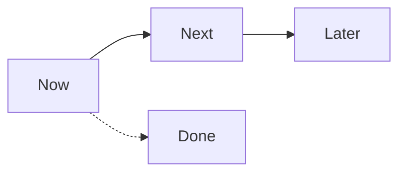
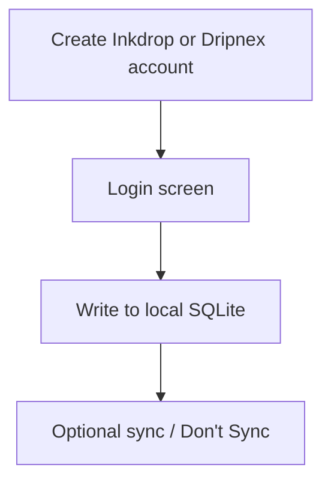

# Updates

Newest first. Not release notes (those stay in [`docs/releases/`](../releases/)).

**Now:** [#542](https://github.com/dripnex/app/issues/542) analysis, [#545](https://github.com/dripnex/app/issues/545) AuthGate, [#546](https://github.com/dripnex/app/issues/546) What's New + site, [#547](https://github.com/dripnex/app/issues/547) plugin install.

**Next:** [#548](https://github.com/dripnex/app/issues/548) statuses/search/revisions, [#549](https://github.com/dripnex/app/issues/549) sync merge, [#550](https://github.com/dripnex/app/issues/550) coverage floor.

**Later:** [#551](https://github.com/dripnex/app/issues/551) mobile + clipper.

**Done:** [#543](https://github.com/dripnex/app/issues/543) e2e CM, [#544](https://github.com/dripnex/app/issues/544) Dependabot e2e.

Board: [dripnex/projects/3](https://github.com/orgs/dripnex/projects/3). Not Linear.

## 2026-08-22

- Mobile **started**. Tomás said go. `dripnex/ios` created (private). Reuse is `NoteSnapshot` + `sync-core` wire. Contract: `docs/mobile/CONTRACT.md`. Two-profile desktop sync stays a P3 risk, not a P1 blocker.
- AuthGate stays. Inkdrop start guide + privacy 5.4. ADR 002.
- SQLite, not CouchDB. ADR 003.
- MCP over Local HTTP (Bearer, 127.0.0.1:29168). Settings snippets must copy URL+token. ADR 004. Code: PR 554.
- Technical decisions go in `docs/adr` + this folder. Mobile plan: `docs/mobile/PLAN.md`. ADR 005. Issue #551.
- #541 e2e CM merged. #552 Dependabot HTTPS rewrite merged. No release for CI-only.
- GitHub Project: https://github.com/orgs/dripnex/projects/3 (not Linear).

The sections below are the long form behind those calls, from the Dripnex Indie sweep.

### AuthGate stays

Inkdrop **has** an AuthGate. [Get started](https://docs.inkdrop.app/start-guide): create account, download, then "You'll see a login screen." [Privacy 5.4](https://docs.inkdrop.app/privacy): "you must have an Inkdrop account to use the Inkdrop client apps." Offline and Don't Sync are after login.

Earlier "remove AuthGate to be like Inkdrop / because SQLite" write-up was wrong. [#545](https://github.com/dripnex/app/issues/545) retitled. [#542](https://github.com/dripnex/app/issues/542) noted.

### MCP / other AIs

Do not invent a Grok-only connector. Copy Inkdrop: local HTTP in the signed-in app + one MCP package. Grok Bot, Claude, and Cursor attach to that. Plan: [mcp-plan.md](./mcp-plan.md).

This was written as "later, not v1", blocked on plugin install ([#547](https://github.com/dripnex/app/issues/547)). ADR 004 has since accepted the shape and the code is PR 554.

Existing `packages/mcp-server` (stdio to SQLite, writes off by default) stays as the current path until HTTP exists.

### Quality shipped today

- [#541](https://github.com/dripnex/app/pull/541) merged: Playwright types into CodeMirror. Closed [#543](https://github.com/dripnex/app/issues/543).
- [#552](https://github.com/dripnex/app/pull/552) merged: e2e + commitlint rewrite git SSH to HTTPS so Dependabot lockfiles can `pnpm install`. Closed [#544](https://github.com/dripnex/app/issues/544). **No release** (workflow only). Existing Dependabot PRs still need rebase onto `develop` before automerge.

### Architecture calls (do not reopen)

- Local store is **SQLite**. Inkdrop v6 dropped LevelDB; CouchDB/PouchDB+Cloudant is 2017-18. Do not plan CouchDB self-host as parity.
- Canonical repo `dripnex/app` (`dripnex/readide` redirects). Default branch `develop`. Latest release v0.16.0. `develop` package.json may still say 0.15.2.
- Do not invent clipper, marketplace, graph, or AI-notetaker as Now work.
- iOS/iPad lives in `dripnex/ios` -- never inside `dripnex/app`. ADR 005. The repo exists as of this date; see the mobile bullet above.
- User-facing What's New stays handwritten in `docs/releases/`.
