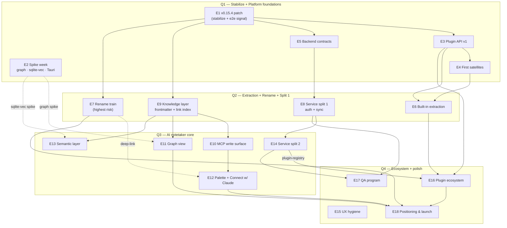

# Dripnex — Dependency Map & Critical Path

> **Status:** Living planning doc derived from the GitHub issue tree (E1–E18, 116 issues).
> The issues remain the source of truth; this is the cross-cutting view they can't show:
> the dependency DAG, the critical path, spike gates, and a 2-person parallelization plan.

## TL;DR

- **Three keystones:** **E1** (foundation — blocks everything), **E9** (knowledge substrate —
  blocks all of Q3), **E10** (the MCP write-loop — _the_ value of the pivot).
- **The differentiator ships in Q3.** Q1–Q2 are prelude (stabilize + platform + rename).
  There is no demonstrable "dripnex moment" until E9→E10→E12 land mid-year.
- **Longest dependency chain = the backend split** (E5→E8→E14→E16). It's also the highest
  scope/capacity risk — see D3 in the reconciliation doc.
- **Two spike gates** decide Q3 subsystems: graph WebGL (#318→E11) and sqlite-vec (#319→E13).

---

## 1. Epic dependency DAG

> **Note:** E1 is drawn feeding the four chain-heads it actually unblocks; in practice its
> e2e-signal task (#309) gates _everything_ — nothing should merge on a red e2e suite.

---

## 2. The dependency chains, ranked

| Chain                             | Depth | What it delivers                                   | Risk                                                     |
| --------------------------------- | ----- | -------------------------------------------------- | -------------------------------------------------------- |
| **Backend:** E1→E5→E8→E14→E16→E18 | 6     | Microservices + marketplace + launch               | ⚠️ Longest; biggest capacity cost (D3)                   |
| **Value loop:** E1→E9→E10→E12→E18 | 5     | The agent write-loop — the pivot's reason to exist | 🎯 Demo-critical                                         |
| **Platform:** E1→E3→E4→E6→E16→E18 | 6     | Plugin API → satellites → marketplace              | Steady, well-sequenced                                   |
| **Graph:** E2⇢E11, E9→E11→E18     | —     | The differentiator UI                              | Gated on spike (#318)                                    |
| **Semantic:** E2⇢E13, E9→E13      | —     | Embeddings / related notes / ContextBuilder v2     | Gated on spike (#319); degrades to link-only if it slips |
| **Rename:** E1→E7→E18             | —     | Identity change                                    | 🔴 Highest single-epic risk; ships alone                 |

**Read this as:** the product's _value_ (value loop) is only 5 deep and mostly TS app work.
The _operational cost_ (backend chain) is 6 deep and the part most worth trimming for a
2-person team.

---

## 3. Spike gates (decide before building)

| Spike                              | Gates            | Pass bar                                                    | If it fails                                                     |
| ---------------------------------- | ---------------- | ----------------------------------------------------------- | --------------------------------------------------------------- |
| #318 graph WebGL                   | E11              | 5k nodes / 20k edges ≥ 30 fps in Electron                   | E11 ships with degradation/ego-graph only, or library swap      |
| #319 sqlite-vec                    | E13              | semantic beats FTS5 on a golden-query eval over the real DB | E13 ships link-only; ContextBuilder v2 works without embeddings |
| #320 Tauri                         | (stack decision) | paper PoC only — door stays closed regardless               | Record decision (#321), kill the option                         |
| #380 Connect w/ Claude (Agent SDK) | E12              | official-path auth ergonomics acceptable                    | E12 falls back to demoted API-key path                          |

**Run E2's spikes in Q1, in parallel with E1.** Their verdicts shape two whole Q3 epics, so
late spikes = late re-planning.

---

## 4. Suggested re-sequencing

1. **Pull frontmatter schema (#363) into late Q1.** E9 is the keystone for all of Q3 but
   sits in Q2. The _schema_ (not the full link index) is small and pure-core; landing it
   early de-risks E10/E11/E13 and lets the MCP tool contract stabilize sooner. Fold in D1
   (the `type` enum) while doing it.
2. **Gate E14 by trigger, not by calendar** (reconciliation D3). Keep `billing-webhooks`;
   defer `ai-gateway` (desktop BYO doesn't use it) and `plugin-registry` (only when E16 is next).
3. **Protect the rename week (E7).** Its body already says "nothing else ships in its week" —
   hold the line; the upgrade-path e2e (#354) is the only gate.
4. **Treat E17 (QA) as continuous, not Q4.** Its own body says charter items burn down
   ~3/week across all quarters. Q4 is just where completion is _tracked_, not where QA starts.

---

## 5. Parallelization for 2 people

The `wf:` labels are already a clean work-breakdown into 9 tracks. Mapped to two owners
(adjust to reality — Alicio is referenced as the graph owner in E11):

| Owner                     | Primary tracks                                                                                      | Rationale                                                                                             |
| ------------------------- | --------------------------------------------------------------------------------------------------- | ----------------------------------------------------------------------------------------------------- |
| **Founder**               | `wf:stabilization`, `wf:knowledge-layer`, `wf:mcp-agents`, `wf:backend-services`, `wf:rename-brand` | The keystones + risky/identity work + backend; the spine of the value loop                            |
| **Collaborator (Alicio)** | `wf:graph`, `wf:palette-ux`, plus `wf:plugin-platform` extractions                                  | Graph is explicitly theirs; palette + satellite extractions are isolatable, plugin-API-mediated units |
| **Shared / async**        | `wf:qa-infra`                                                                                       | Continuous; both contribute, neither owns full-time                                                   |

**Parallelism rules that fall out of the DAG:**

- E2 spikes ∥ E1 (independent — start day 1).
- Once E3's RFC (#322) lands, E4 satellites ∥ E5 backend contracts (different tracks, no shared files).
- E9 (founder) ∥ E6 extraction (collaborator) in Q2 — but **E7 rename is a stop-the-world week** for both.
- In Q3, the value loop (E9→E10→E12, founder) runs ∥ graph (E11, collaborator) ∥ semantic
  (E13, gated). E14 backend is the deferrable one.

**Capacity reality check:** ~30 / 28 / 24 / 16 child tasks per quarter ≈ 2–2.5 tasks/week
sustained, with several large items (table WYSIWYG #342, WebGL graph #375, 5-Worker split).
This is aggressive but the sequencing is sound. The deferrals in §4.2 are the main lever if
velocity lags — cut backend surface before cutting the value loop.

---

## 6. What "done" looks like per quarter

| Q   | Demonstrable outcome                                                                                                                                    |
| --- | ------------------------------------------------------------------------------------------------------------------------------------------------------- |
| Q1  | Green e2e gate, signed v0.15.4 shipped, plugin-API RFC + npm publish, spike verdicts recorded                                                           |
| Q2  | App is "dripnex" (rename done, zero data loss), built-ins are real satellites, frontmatter+backlinks live                                               |
| Q3  | **The pivot is real:** Claude Code/Desktop writes validated notes via MCP, graph renders, palette + Connect-with-Claude work, semantic search beats FTS |
| Q4  | Marketplace browses real registry, QA is a credible gate, dripnex.app launched around the MCP write-loop demo                                           |
