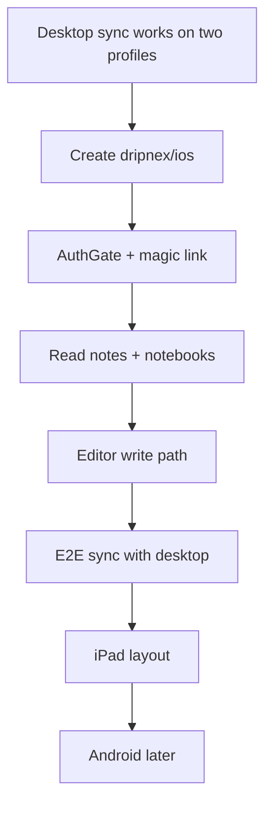
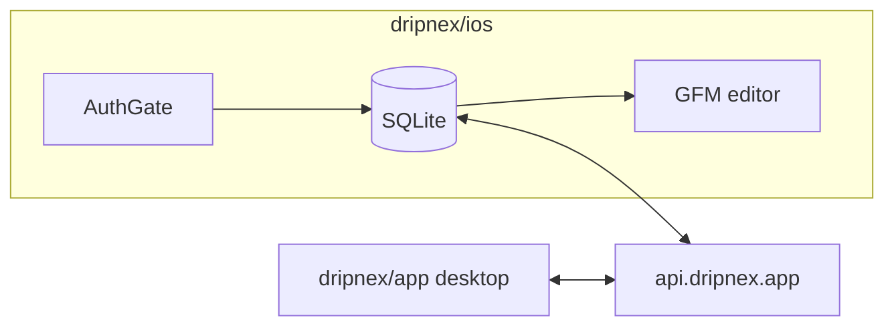

# Mobile plan

Status: **plan only**. Later, not v1. Do not open `dripnex/ios` until the gate below is green.
Issue: [#551](https://github.com/dripnex/app/issues/551). Decision: [ADR 005](../adr/005-mobile-own-repo.md).

Inkdrop ships iOS/Android after the same account login. Copy that product shape, not a guest-only phone editor.

## Why not now

Desktop still has to prove the write path and sync (two desktop profiles / two machines). Mobile without that is a second offline silo. Clipper stays with mobile as Later, not a side quest.

## Gate (must be true first)

1. AuthGate stays on desktop (ADR 002).
2. Two desktop profiles can edit the same account and merge without data loss (#549).
3. Local HTTP + MCP are the agent path on desktop (ADR 004). Phone does not need MCP v1.
4. Tomas says go. Ask only for that / release / signing.

## Repo and stack

| | Choice | Why |
| --- | --- | --- |
| Repo | `dripnex/ios` (new, private) | Never inside `dripnex/app` |
| First OS | iPhone, then iPad | Inkdrop-shaped; Android after dogfood |
| UI | SwiftUI | Native, one store, no Electron in a phone |
| Notes DB | SQLite on device | ADR 003. Same fields as desktop |
| Editor | GFM in a WKWebView CodeMirror 6 shell, or a native markdown TextView if CM is too heavy | Editor is the product. Do not invent a WYSIWYG |
| Auth | Same account / magic link as desktop | AuthGate on first launch |
| Sync | `api.dripnex.app` after login, Don't Sync valid | Same as desktop |
| Plugins | Not v1 | Desktop plugin path (#547) first |

Do not use Capacitor wrapping the desktop app. Do not put React Native inside `dripnex/app`.

## Product shape (v1 phone)

- Login, then three panes collapsed to list + editor (Inkdrop mobile).
- Inbox default. Statuses: hide completed/dropped in the main list.
- GFM only. One note per issue when that workflow exists on desktop.
- Offline after login. Local SQLite is source of truth.
- Share sheet / clipper: **not** phone v1 (same Later bucket as #551).

## Phases

**P0 — desktop (now, still in dripnex/app)**
Prove sync merge + attachments (#549). No iOS repo yet.

**P1 — skeleton (`dripnex/ios`)**
Xcode project, AuthGate, empty Inbox, read-only notes from sync. TestFlight internal.

**P2 — write path**
Create / edit / trash. Titles = first non-empty line. Templates if desktop templates already sync.

**P3 — sync dogfood**
Same account: type on phone, see it on desktop, and the reverse. Conflict UI: keep this / keep other / open both (desktop already has this).

**P4 — iPad**
Three-pane optional. Not a new app.

**P5 — Android / clipper**
Only after iOS is a daily driver. Clipper can be a share extension on iOS first, still Later.

## Out of scope

- Marketplace, graph, AI-notetaker, hosted note MCP on the phone
- Building inside `dripnex/app`
- Starting P1 before the gate

## Done when (later)

Tomas can jot a note on iPhone after login, open it on desktop, and the markdown is the same. Until then this file is the plan, not a build ticket.
