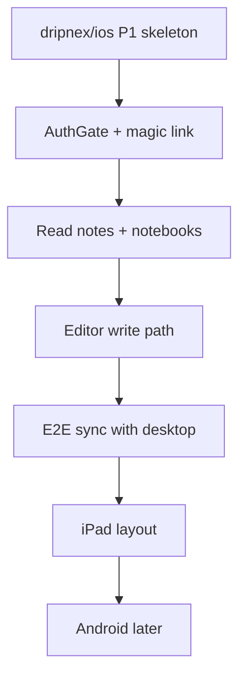
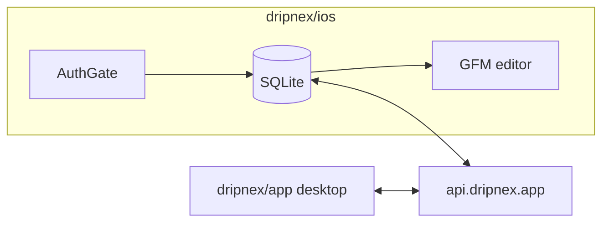

# Mobile plan

Status: **started**. Tomás said go on 2026-08-22. P1 is [`dripnex/ios`](https://github.com/dripnex/ios) (private, created the same day). No iOS code in `dripnex/app`.
Issue: [#551](https://github.com/dripnex/app/issues/551). Decision: [ADR 005](../adr/005-mobile-own-repo.md). Contract: [CONTRACT.md](./CONTRACT.md).

Inkdrop ships iOS/Android after the same account login. Copy that product shape, not a guest-only phone editor.

## Why not a daily driver yet

Desktop still has to prove the write path and sync (two desktop profiles / two machines). That is a **P3 risk**, not a P1 blocker: if people write on the phone before merge is proven, mobile is a second offline silo. Clipper stays Later, not a side quest.

## Gate

Satisfied for P1 (2026-08-22):

1. AuthGate stays on desktop (ADR 002).
2. Local HTTP + MCP are the agent path on desktop (ADR 004). Phone does not need MCP v1.
3. Tomás said go. Ask only for release / signing / TestFlight.

**P3 risk (not a skeleton blocker):** two desktop profiles can edit the same account and merge without data loss (#549). Keep it on the P3 dogfood phase. Do not wait on it to start P1 in `dripnex/ios`.

## Repo and stack

|          | Choice                                                                                  | Why                                            |
| -------- | --------------------------------------------------------------------------------------- | ---------------------------------------------- |
| Repo     | `dripnex/ios` (private, created 2026-08-22)                                             | Never inside `dripnex/app`                     |
| First OS | iPhone, then iPad                                                                       | Inkdrop-shaped; Android after dogfood          |
| UI       | SwiftUI                                                                                 | Native, one store, no Electron in a phone      |
| Notes DB | SQLite on device                                                                        | ADR 003. Same fields as desktop                |
| Editor   | GFM in a WKWebView CodeMirror 6 shell, or a native markdown TextView if CM is too heavy | Editor is the product. Do not invent a WYSIWYG |
| Auth     | Same account / magic link as desktop                                                    | AuthGate on first launch                       |
| Sync     | `api.dripnex.app` after login, Don't Sync valid                                         | Same as desktop                                |
| Plugins  | Not v1                                                                                  | Desktop plugin path (#547) first               |

Do not use Capacitor wrapping the desktop app. Do not put React Native inside `dripnex/app`. iOS copies [CONTRACT.md](./CONTRACT.md); it does not invent note or sync fields.

## Product shape (v1 phone)

- Login, then three panes collapsed to list + editor (Inkdrop mobile).
- Inbox default. Statuses: hide completed/dropped in the main list.
- GFM only. One note per issue when that workflow exists on desktop.
- Offline after login. Local SQLite is source of truth.
- Share sheet / clipper: **not** phone v1 (same Later bucket as #551).

## Phases

**P0 — desktop (still in dripnex/app)**
Prove sync merge + attachments (#549). That work stays here. It does not block the P1 skeleton.

**P1 — skeleton (`dripnex/ios`, started)**
Xcode project, AuthGate, empty Inbox, local SQLite. Read-only notes when sync exists; do not block the skeleton on two-profile desktop sync. No iOS sources in this repo. TestFlight only with Tomás.

**P2 — write path**
Create / edit / trash. Titles = first non-empty line. Templates if desktop templates already sync.

**P3 — sync dogfood**
Same account: type on phone, see it on desktop, and the reverse. Conflict UI: keep this / keep other / open both (desktop already has this). Two-profile desktop merge (#549) is the quality risk in this phase.

**P4 — iPad**
Three-pane optional. Not a new app.

**P5 — Android / clipper**
Only after iOS is a daily driver. Clipper can be a share extension on iOS first, still Later.

## Out of scope

- Marketplace, graph, AI-notetaker, hosted note MCP on the phone
- Building inside `dripnex/app`
- Treating two-profile desktop sync as a P1 gate

## Done when (later)

Tomas can jot a note on iPhone after login, open it on desktop, and the markdown is the same. Until then P1 is the skeleton in `dripnex/ios`, not a daily-driver ticket.
